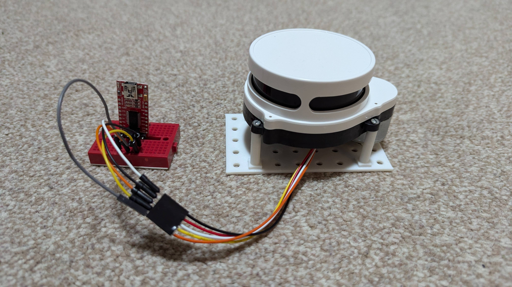
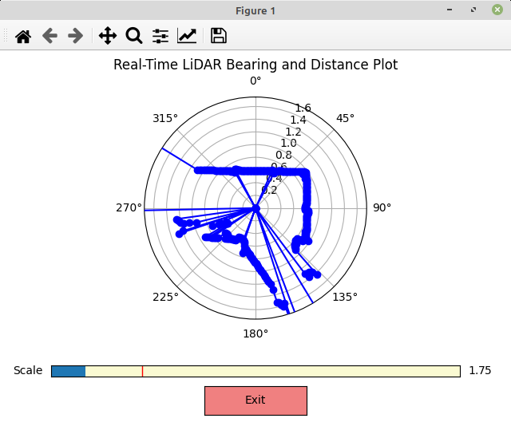
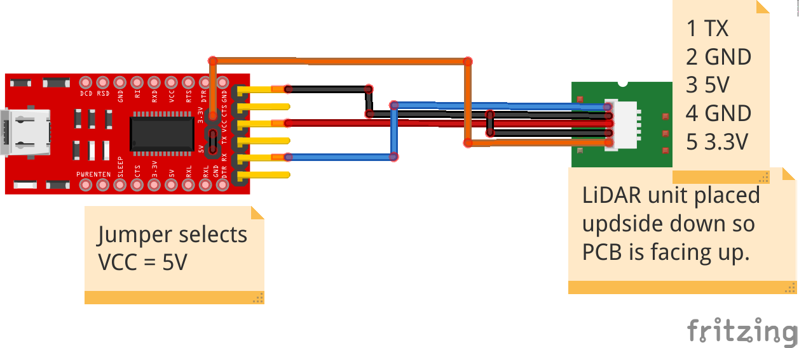

# LiDARtest
This is a quick confidence check for a Delta-2G LiDAR module that I obtained from AliExpress. To run the program use "python3 LiDARplot", it defaults to /dev/ttyUSB0 and 115200 baud for the TTL UART device but these can be overriden using the -d and -s flags. e.g. "python3 LiDARplot -d /dev/ttyUSB1 -s 76800"

It is supplied as a replacement robot vacuum part and comes without any documentation. There are a couple of photos on the AliExpress webpage but not enough information to use the LiDAR in a hobby project. [Not Black Magic](https://notblackmagic.com/bitsnpieces/lidar-modules/) published an extremely useful LiDAR introduction and teardown of this unit [complete with some code](https://github.com/NotBlackMagic/Delta-2G-LiDAR-Driver) to access the device data stream. I back ported the Python 3.10+ module to be compatible with earlier Python 3 versions and added the graphical output below.

# Sample output

This is a display taken in a corridor which is open to the left, has a half open door at the bottom and some soft bags against the bottom wall of the corridor. Use the "Scale" to alter the radius of the map measured in metres. Press the "Exit" button to quit the test. I've managed to test the range to a radius of 7.5 metres but that is the limit of my internal space so it may do more.

# Wiring diagram

# 3D printed support/mount

I designed a support mount (LiDARmount.stl) that is Meccano compatible and visible in the main photo above.

# Links

Please support this and future projects by using these affiliate links.

[The Delta 2G LiDAR unit](https://www.aliexpress.com/item/1005004139703179.html?spm=a2g0o.detail.0.0.42e3k4F6k4F6Yr&mp=1/LiDARrange.png)
The original order said it would take 4 to 5 weeks but it arrived in a week.
